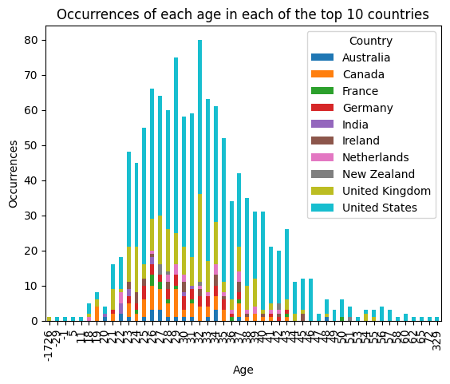
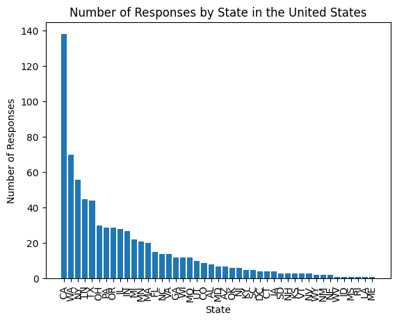

# Final Report

## Introduction

Our project involves answering various questions (which we will list below) in regards to mental health issues in the tech industry. We believe it is important to research the health issues that are present in tech because while the tech industry can indeed pay well to an extent, it is certainly not free from being stressful.

## Question 1 (Analysis 1/EDA)

This question was: **is mental health issues in relation with an individual's age? More specifically, the older the individual is the more common it is for them to experience these issues? If they are from the United States, which state has the most occurrences of these problems in mental health?**

In answering this question, we had to remove some unnecessary information such as negative and extreme (an age of 329) ages to make the data realistic.

Since there was a big list of countries to choose from with our dataset, we decided to just focus on the United States as this is where the most occurrences of mental health issues were. This is illustrated by the figure below:

##### The figure above demonstrates the top 10 countries with the most occurrences of mental health issues. The United States (in blue) has the most so that is why we will be focusing our attention on that country.

After isolating the country to be the United States we then found the U.S state with the most occurrences of mental health issues with the figure below:

Finally, we then found the number of occurrences between each age group in the United States with the visualization below:

From these two visualizations (U.S states and Age Ranges) we can see that there is almost 400 occurrences of Mental Health issues between individuals aged 26 - 35. In terms of states, California seems to be the one with the most occurrences of mental health issues.

With this information, we can make the conclusion below.

**Note:** For more informations or the inner workings on how this was performed, please see the [Analysis 1 Jupyter Notebook](analysis/analysis1.ipynb)

## Question 2 (Analysis 2/EDA)

{TO-DO}

**Note: Feel free to change up the document!**

## Summary/Conclusion

**Question 1:**

- Based on the visualizations above, mental health issues are indeed in relation with an individual's age.
- However, it seems that the younger age group seems to have the most highest number of occurrences. Leading my initial hypothesis to be incorrect!
- The U.S state with the highest number of mental health issues is California
- It's important to note that how and why California has the most occurrences is out of the scope of this dataset and there could be a multiple of factors!
  
**Question 2:**

- {Point 1 ANYTHING can be here!}
- {etc.}

**Final Thoughts:**  
Anilov Laxina (ID: 36694933):  
I learned that age can indeed take part in mental health issues in tech. However, it was unexpected that the younger age group had more mental health issues than the older age group. All in all, I learned that even though the tech industry may be the field that many individuals want to pursue, it is like many other jobs where it is also not free from mental health problems!

