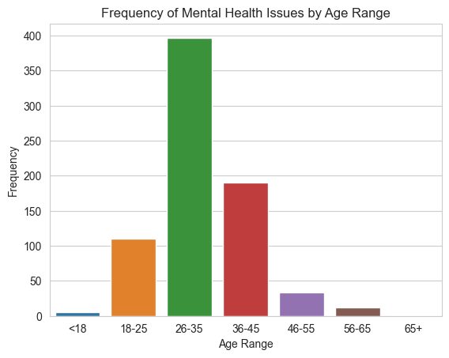

# Final Report

## Introduction

Our project involves answering various questions (which we will list below) in regards to mental health issues in the tech industry. We believe it is important to research the health issues that are present in tech because while the tech industry can indeed pay well to an extent, it is certainly not free from being stressful.

## Question 1 (Analysis 1/EDA)

This question was: **is mental health issues in relation with an individual's age? More specifically, the older the individual is the more common it is for them to experience these issues? If they are from the United States, which state has the most occurrences of these problems in mental health?**

In answering this question, we had to remove some unnecessary information such as negative and extreme (an age of 329) ages to make the data realistic.

Since there was a big list of countries to choose from with our dataset, we decided to just focus on the United States as this is where the most occurrences of mental health issues were. This is illustrated by the figure below:

##### The figure above demonstrates the top 10 countries with the most occurrences of mental health issues. The United States (in blue) has the most so that is why we will be focusing our attention on that country.

After isolating the country to be the United States we then found the U.S state with the most occurrences of mental health issues with the figure below:

Finally, we then found the number of occurrences between each age group in the United States with the visualization below:

From these two visualizations (U.S states and Age Ranges) we can see that there is almost 400 occurrences of Mental Health issues between individuals aged 26 - 35. In terms of states, California seems to be the one with the most occurrences of mental health issues.

With this information, we can make the conclusion below.

**Note:** For more informations or the inner workings on how this was performed, please see the [Analysis 1 Jupyter Notebook](analysis/analysis1.ipynb)

## Question 2 (Analysis 2/EDA)

The research question is:
Is there a relationship between the gender of an employee and the importance they give and recieve to their mental health and care at their workplace?

To answer this question, I cleaned the dataset to sort the gender column into three categories and also remove inconsistent values that are not useful for my question. I created a subset dataset with columns relevant to my question by dropping columns and also dropping the columns that had a lot of missing information. 
I then chose columns that would indicate how well employers provide mental health benefits and care to their employees and creating visualizations grouped by gender to see if there is a disparity in how different genders of the employees think of the mental health care they recieve.

For example the visualization below shows how many employees of different genders recieve mental health benefits at their workplace:

Another area of my research question was that regarding how much care employees themselves seek out for. The visualization below shows how the different genders of employees seek treatment for their mental health issues:

Another question I also answered how the different genders of employees believed that discussing their mental health issues with their employers will result in a negative consequence. The visualization below shows how this looks like when sorted by gender:

These were some of the many areas of the question I investigated and visualized.

## Summary/Conclusion

**Question 1:**

- Based on the visualizations above, mental health issues are indeed in relation with an individual's age.
- However, it seems that the younger age group seems to have the most highest number of occurrences. Leading my initial hypothesis to be incorrect!
- The U.S state with the highest number of mental health issues is California
- It's important to note that how and why California has the most occurrences is out of the scope of this dataset and there could be a multiple of factors!
  
**Question 2:**

The observations from my analysis brought me many interesting conclusions:
- A lot of men in tech do not seek for help and treatment for their mental health issues. This is seen with the 50% of men that do not seek treatment for their mental health issues and also how there is a signficant number of male employees that do not know if their employers have resources on how they can seek for help for their issues.
- A significant number of women in the tech industry also think that there will be negative consequence to their employment  if they discuss their mental health issues. this is also true for the other genders but there was a significant number in comparison when female employees were observed and analysed.
- It can also be concluded that not a lot of employers include mental health services into the wellness programs that employees recieve at their work and this is something that should be addressed and highlighted in the industry as it is true for all genders across the industry. 

**Final Thoughts:**  
Anilov Laxina (ID: 36694933):  
I learned that age can indeed take part in mental health issues in tech. However, it was unexpected that the younger age group had more mental health issues than the older age group. All in all, I learned that even though the tech industry may be the field that many individuals want to pursue, it is like many other jobs where it is also not free from mental health problems!

Harshitha Bannur (ID: 41293937)
This project was really interesting to work on to as I realised that there are a lot of issues regrading mental health considerations for employees in the tech industry and how the gender of the employee has an impact on these componenents of mental health. I was able to learn that men in tech should be getting more resources and awarenesss of the what they can do seek help for their mental health issues. There should also be an encourgement to de-stigmatize discussions of mental health at work as a lot of employees think it may affect their employees and due to this a lot employees especially a lot men are hesitant to discuss their issues with their employers or co-workers.

